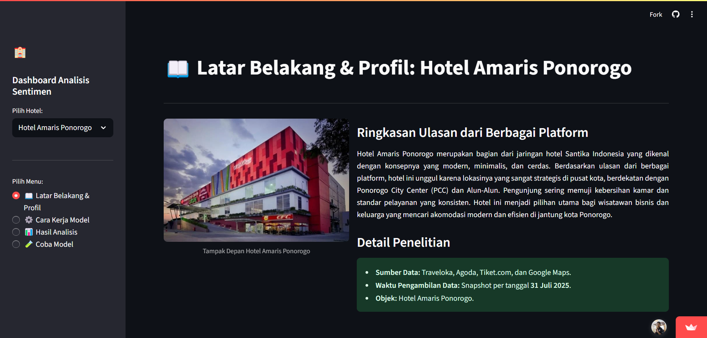
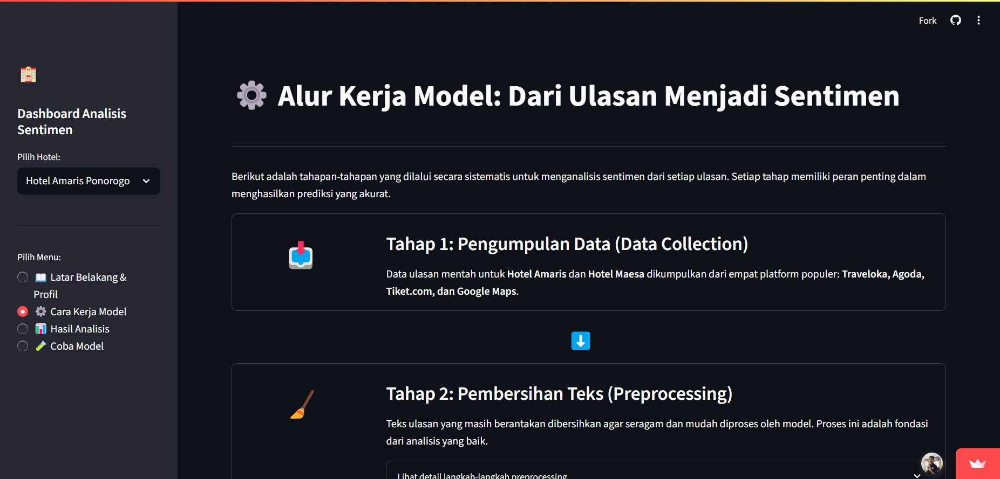
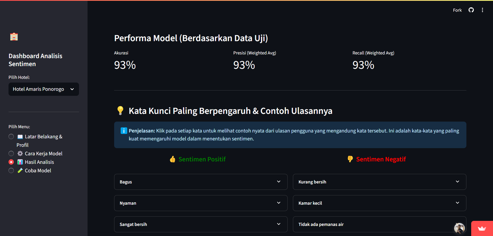
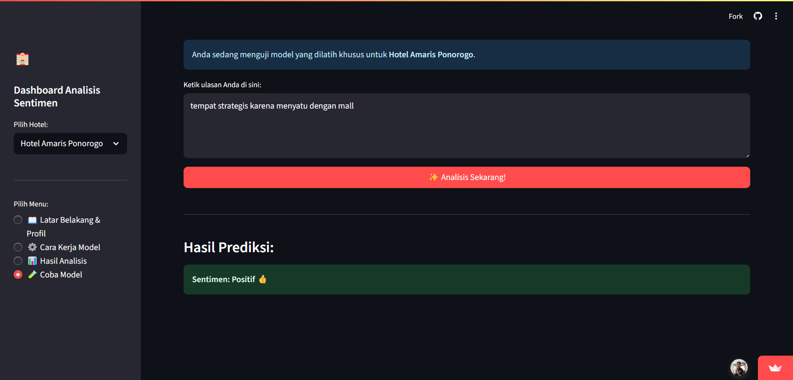

#  Dashboard Analisis Sentimen Hotel di Ponorogo

Aplikasi web interaktif yang dibuat menggunakan Streamlit untuk menganalisis dan memvisualisasikan sentimen dari ulasan pengguna terhadap dua hotel di Ponorogo: **Hotel Amaris** dan **Hotel Maesa**. Proyek ini merupakan bagian dari penelitian skripsi untuk memenuhi syarat kelulusan.

[](https://app-sentimen-hotel-ponorogo.streamlit.app/)

## Deskripsi

Aplikasi ini mengimplementasikan model klasifikasi **Naive Bayes** untuk menentukan sentimen (positif, negatif, netral) dari ulasan yang dikumpulkan dari berbagai platform online. Pengguna dapat membandingkan performa hotel, melihat kata kunci yang paling berpengaruh, dan bahkan mencoba model dengan ulasan mereka sendiri.

## Fitur Utama

-   **Dashboard Interaktif**: Membandingkan hasil analisis untuk dua hotel yang berbeda.
-   **Visualisasi Data**: Menampilkan Word Cloud, distribusi sentimen, dan Confusion Matrix yang dinamis.
-   **Analisis Kata Berpengaruh**: Menunjukkan frasa kunci yang paling memengaruhi prediksi sentimen positif dan negatif, lengkap dengan contoh ulasan nyata.
-   **Uji Coba Model Real-time**: Fitur untuk memasukkan teks ulasan baru dan mendapatkan prediksi sentimen secara langsung.

## Teknologi yang Digunakan

-   **Bahasa**: Python
-   **Library Analisis**: Pandas, Scikit-learn
-   **Model**: Naive Bayes (MultinomialNB)
-   **Ekstraksi Fitur**: TF-IDF
-   **Framework Web**: Streamlit

## Cara Menjalankan Aplikasi Secara Lokal

1.  **Clone repository ini:**
    ```bash
    git clone https://github.com/Shobikh/streamlit-sentimen-hotel-ponorogo.git
    cd streamlit-sentimen-hotel-ponorogo
    ```

2.  **Buat dan aktifkan lingkungan virtual (disarankan):**
    ```bash
    python -m venv venv
    
    .\venv\Scripts\activate # Windows
    
    source venv/bin/activate # Mac/Linux
    ```

3.  **Instal semua library yang dibutuhkan:**
    ```bash
    pip install -r requirements.txt
    ```

4.  **Jalankan aplikasi Streamlit:**
    ```bash
    streamlit run app.py
    ```

## Tampilan Aplikasi





